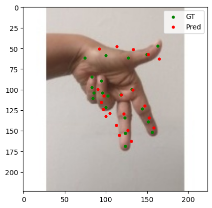
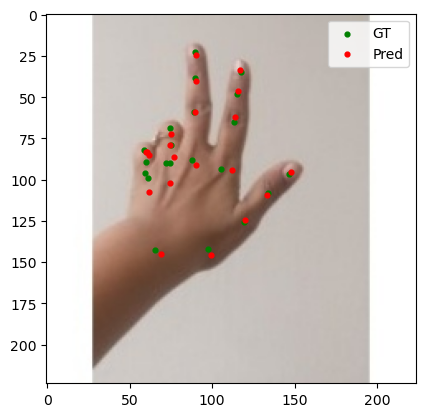

# Hand Keypoints Detection (YOLO vs Heatmap)

  
  
  

## 📌 Overview
This project focuses on **hand keypoints detection with 21 landmarks**, using the official [Ultralytics Hand Keypoints dataset](https://docs.ultralytics.com/datasets/pose/hand-keypoints/).  
The goal is to **outperform YOLO’s default keypoints model** by implementing a **custom heatmap-based approach** with MobileNetV3 as backbone and deploying it **End-to-End on Jetson Orin Nano** for real-time inference from a webcam.

- **Key Features:**
  - Comparison between YOLO-based and Heatmap-based models.
  - Deployment on **Jetson Orin Nano (JetPack 6.x + TensorRT)**.
  - **Real-time webcam inference** with >50 FPS.
  - Trade-off analysis between latency and accuracy.

---

## 🎥 Demo Videos
- 🔹 [Custom Heatmap Model Demo](https://youtu.be/xINhHVZyG6A)  
- 🔹 [YOLO Model Demo](https://youtu.be/2LqOoRhSFb8)  

---

## 🧠 Model Architecture

### Heatmap-based Model
The proposed model adopts a **MobileNetV3-Large backbone** as a lightweight yet powerful feature extractor, pre-trained on ImageNet for transfer learning.  
From this compressed feature space, the model applies a **series of deconvolution layers** (also known as transposed convolutions) combined with **batch normalization and ReLU activations**. These layers progressively upsample the spatial resolution of the features, allowing the network to recover fine-grained spatial details necessary for precise keypoint localization.  

Finally, a **heatmap prediction head** outputs 21 separate heatmaps, one for each hand keypoint.  
Each heatmap encodes the probability distribution of a keypoint’s location, enabling robust and interpretable detection compared to direct coordinate regression.  

This design was chosen after extensive experimentation:  
- **Too few deconvolution layers** → insufficient spatial detail, lower accuracy.  
- **Too many layers** → higher accuracy but increased latency.  
- **Current design** → achieves the best trade-off between accuracy and real-time speed on Jetson Orin Nano.  

### YOLO-based Model
As a baseline, the **Ultralytics YOLO hand keypoints model** was optimized and deployed under the same conditions (TensorRT FP16). While YOLO offers strong general-purpose detection, its performance on fine-grained 21-point hand keypoint localization was found to be less accurate and slower than the custom heatmap-based model.  

---

## 📊 Evaluation Metrics

We use **PCK (Percentage of Correct Keypoints)** as the primary accuracy metric:  
- PCK@X = % of predicted keypoints that fall within **X pixels** of the ground truth.  
- Example: PCK@5px = 83% → means **83% of keypoints are within 5 pixels of GT** (on a 224×224 image).

---

## 🚀 Results

### 🔹 Heatmap Model (TensorRT FP16)
| Threshold | PCK |
|-----------|------|
| 1px       | 0.2065 |
| 3px       | 0.6998 |
| 5px       | 0.8377 |
| 7px       | 0.8954 |
| 10px      | 0.9331 |

- **Average Latency**: 19.35 ms  
- **Inference FPS**: 51.67

**Interpretation**:  
- Excellent accuracy at practical thresholds (PCK@5px ≈ 84%).  
- Real-time inference (>50 FPS) on Jetson Orin Nano without INT8 quantization.  
- Achieves a strong balance of speed and accuracy suitable for edge deployment.  

---

### 🔹 YOLO Model (TensorRT FP16)
| Threshold | PCK |
|-----------|------|
| 1px       | 0.1498 |
| 3px       | 0.5918 |
| 5px       | 0.7720 |
| 7px       | 0.8432 |
| 10px      | 0.8895 |

- **Average Latency**: 32.72 ms  
- **Inference FPS**: 30.56

**Interpretation**:  
- Lower accuracy across all thresholds compared to the heatmap model.  
- Significantly slower inference (≈30 FPS), which is less ideal for real-time applications.  

---

| Heatmap Model | Yolo Model |
|---------------|------------|
|  |  |

| Heatmap Model | Yolo Model |
|---------------|------------|
|  |  |
---

## 🔍 Comparative Analysis
- ✅ **Accuracy**: Heatmap model outperforms YOLO (e.g., PCK@5px: 83.8% vs 77.2%).  
- ✅ **Latency**: Heatmap model is faster (19.35 m🌁s vs 32.72 ms).  
- ✅ **Deployment**: Heatmap model achieves real-time inference (>50 FPS).  
- ⚡ **Conclusion**: Heatmap-based architecture with MobileNetV3 backbone is more **efficient and accurate** for hand keypoints detection on edge devices.  

---

## 🛠 Pipeline
1. **Training**: PyTorch (custom heatmap architecture).  
2. **Export**: Convert trained model to ONNX.  
3. **Optimization**: Build TensorRT FP16 engine.  
4. **Deployment**: Real-time inference on Jetson Orin Nano with webcam.  

---

## ⚙️ Tech Stack
- **Framework**: PyTorch, ONNX  
- **Optimization**: TensorRT (FP16)  
- **Device**: Jetson Orin Nano (8GB)  
- **Language**: Python 3.10  
- **Visualization**: Matplotlib, OpenCV  

---

## 📌 Key Takeaways
- Custom **heatmap-based model** achieves **higher accuracy** and **lower latency** than YOLO.  
- Real-time inference (>50 FPS) makes it suitable for **edge AI applications** like gesture recognition, AR/VR, and HCI.  
- Demonstrates an **End-to-End deployment pipeline** from model design → training → optimization → deployment.  

---

## 🔧 Limitations & Future Work

**Single-hand only (no hand detector stage)**  
   - **Current limitation**: The pipeline predicts keypoints **directly** without a preceding **hand detection** stage. If multiple hands appear, **only one** is handled reliably, and overlapping hands are not separated.  
   - **Plan**: Adopt a **two-stage** pipeline — (A) lightweight hand detector (e.g., YOLO-hand) → cropped ROI per hand, then (B) per-instance keypoints model on each ROI.  
     - Alternative: **One-stage, multi-instance** approach with **instance-aware heatmaps** (e.g., associative embedding / tag heatmaps) to separate hands without an explicit detector.  
     - Add **tracking** across frames (Hungarian matching on keypoint centroids / OKS) for stable multi-hand IDs.

---

## 📜 License & Attribution

- **Code**: MIT License (see `LICENSE`).
- **Dataset**: Ultralytics **Hand Keypoints Dataset** — **CC BY-NC-SA 4.0**  
  https://docs.ultralytics.com/datasets/pose/hand-keypoints/
- **YOLO Components**: Ultralytics **AGPL-3.0** (or commercial license)  
  https://www.ultralytics.com/license

> Third-party software and trademarks are subject to their respective licenses.

